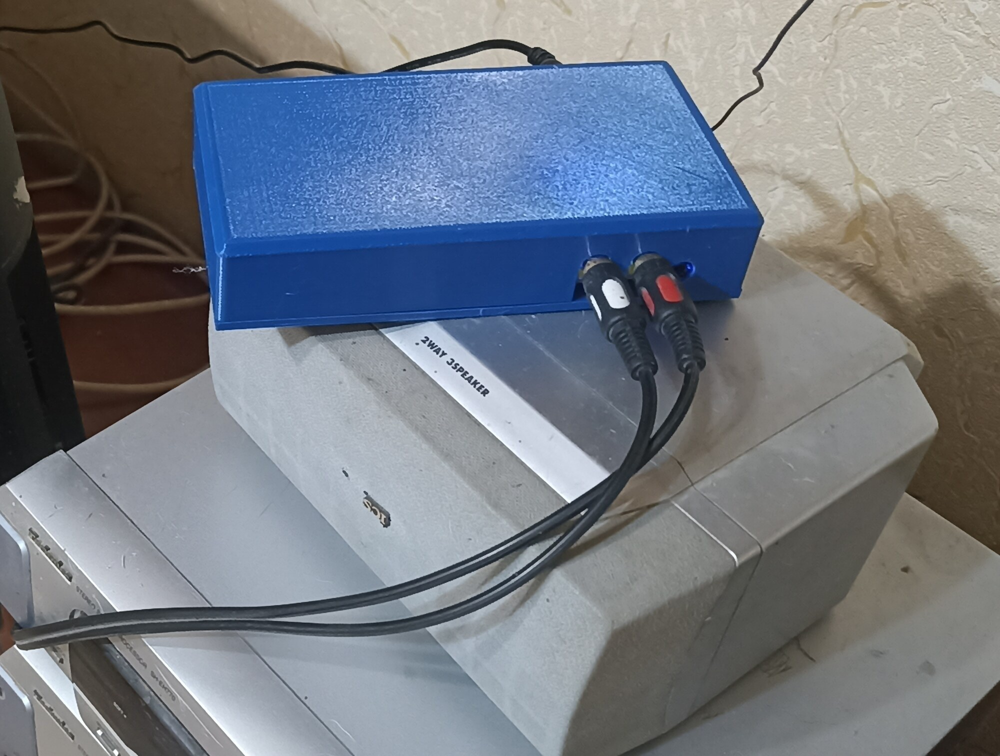
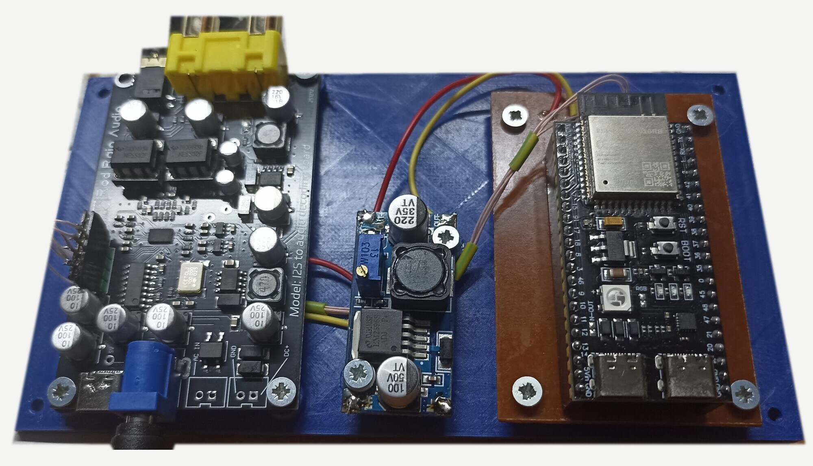
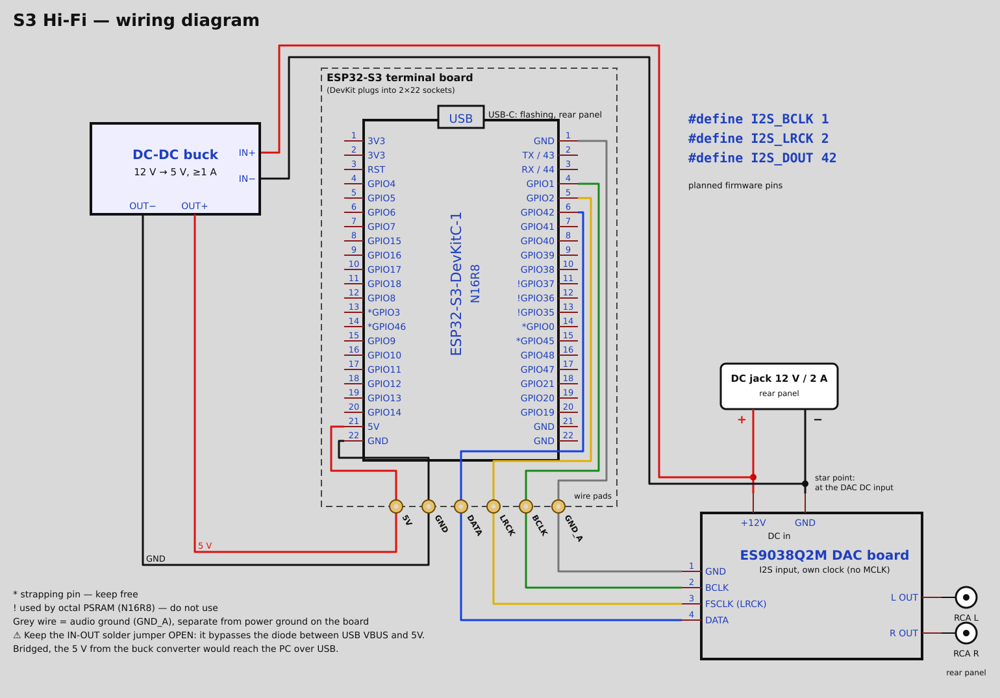
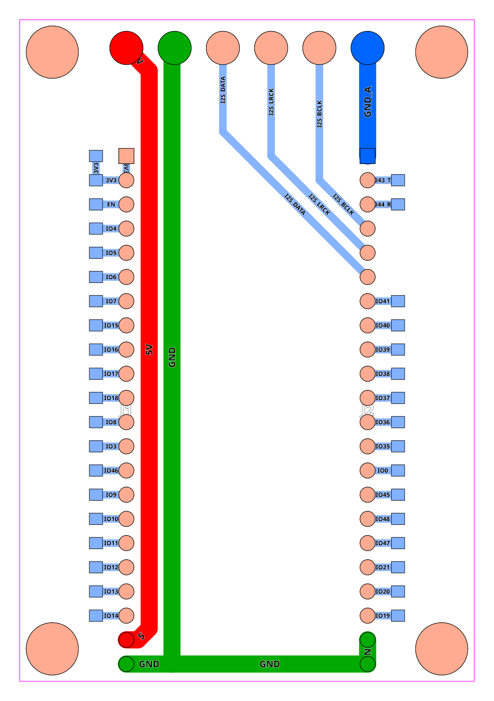

# S3 Hi-Fi

[English](README.md) · **Русский**

Сетевой Hi-Fi плеер для своей фонотеки (FLAC, WAV, MP3, DSD) и интернет-радио. Музыка лежит на домашнем сервере,
плеер на ESP32-S3 принимает готовый поток по Wi-Fi и отдаёт его в ЦАП ES9038Q2M.
Управление — с телефона, из браузера.

> **Статус:** в разработке, но уже играет. Готовы сервер, прошивка плеера v0.1 и корпус;
> первый стенд играет FLAC и радио. Дальше — дисплей и установщик под Windows.

  
  

Первая сборка: в корпусе на музыкальном центре и внутри.

## Быстрый старт

1. **Сервер** на Linux-компьютере, где лежит музыка:
   `curl -fsSL https://raw.githubusercontent.com/michkar-ekb/esp32-hifi-player/main/install.sh | sudo sh -s -- /путь/к/музыке`
   (Windows: [`s3hifi-windows-amd64.exe`](https://github.com/michkar-ekb/esp32-hifi-player/releases/latest), см. [server](server)).
2. **Плеер**: залить `s3hifi-player-esp32s3-n16r8.bin` из [Releases](https://github.com/michkar-ekb/esp32-hifi-player/releases/latest),
   подключить телефон к Wi-Fi «S3 Hi-Fi Setup» и выбрать свою сеть. Сервер плеер найдёт сам.
3. **Пульт**: открыть на телефоне `http://<сервер>:8097`.

## Как это работает

- **Стриминг-сервер** (домашний ПК или мини-ПК, Windows или Linux) хранит музыку, раскодирует
  FLAC / WAV / MP3 / DSD и MP3-радио в PCM, ведёт очередь и список радиостанций, отдаёт веб-пульт.
- **ESP32-S3** ничего не декодирует: принимает PCM-поток по TCP, держит буфер ~10 секунд в PSRAM
  и ровно выдаёт его в I2S. Темп задаёт сам плеер, поэтому часы сервера и плеера не расходятся.
- **ЦАП ES9038Q2M** со своим генератором (MCLK не нужен) выдаёт линейный сигнал ~2 В
  на усилитель или активные колонки.

Потолок качества — 24 бит / 96 кГц: поток 4,6 Мбит/с, Wi-Fi спокойно тянет.

## Детали

| Узел | Что | Примечание |
|---|---|---|
| Плеер | ESP32-S3 DevKitC-1, **N16R8** | PSRAM обязательна — под буфер |
| ЦАП | плата ES9038Q2M (Rod Rain Audio) | вход I2S: GND, BCLK, FSCLK, DATA; выход RCA |
| Питание | блок 12 В / 2 А + DC-DC понижающий модуль 12 → 5 В | 12 В идёт на ЦАП, 5 В — на ESP32-S3 |
| Терминальная плата | терминальная плата ESP32-S3 (в этом репозитории) | гнёзда под девкит + 6 площадок под провода |

## Подключение

| ESP32-S3 | Площадка терминальной платы | ЦАП |
|---|---|---|
| 5V | 5V | — (от DC-DC модуля) |
| GND | GND | — (от DC-DC модуля) |
| GPIO42 | DATA | DATA |
| GPIO2 | LRCK | FSCLK |
| GPIO1 | BCLK | BCLK |
| GND | GND_A | GND |

Питание расходится **звездой прямо на входном разъёме ЦАПа**: одна пара проводов на ЦАП,
другая — на DC-DC модуль. Ток ESP32 не бежит по дорожкам ЦАПа.

## Терминальная плата ESP32-S3

Девкит вставляется в гнёзда, а все нужные плееру сигналы выведены на крупные площадки
под пайку проводов. Односторонняя, 48 × 69,65 мм, все дорожки снизу — под ЛУТ или маркер на 3D-принтере.

- `hardware/pcb/terminal_board_gerber.zip` — Gerber для заказа или травления
- `hardware/pcb/terminal_board_bottom_marker.stl` — нижний слой для печати маркером (зеркально, 0,2 мм)

## Программы

- [`server/`](server) — стриминг-сервер на Go со встроенным веб-пультом: папки, очередь, радио.
  Одна программа для **Windows и Linux**.
- [`firmware/`](firmware) — прошивка плеера для ESP32-S3 (ядро Arduino 2.0.17).

Плате ES9038Q2M нужны **32-битные отсчёты I2S**: с 16-битными слотами она выдаёт шум.
DSD сервер переводит в PCM 24 бит / 88,2 кГц: гребёнка I2S платы не умеет «родной» DSD.

## Корпус

Площадка и крышка для 3D-печати, `hardware/case/`: ЦАП, DC-DC модуль и терминальная плата на стойках;
спереди RCA и джек для наушников, сзади 12 В и оба USB-C. Рёбра скруглены на 3 мм, печать без поддержек.
Крышка держится на четырёх винтах M3 × 12 снизу. Модели строятся скриптами на Python (trimesh),
размеры легко поменять.

## Лицензия

Код — MIT. Схема и плата — CC BY-SA 4.0: повторяйте и переделывайте, указав автора.
